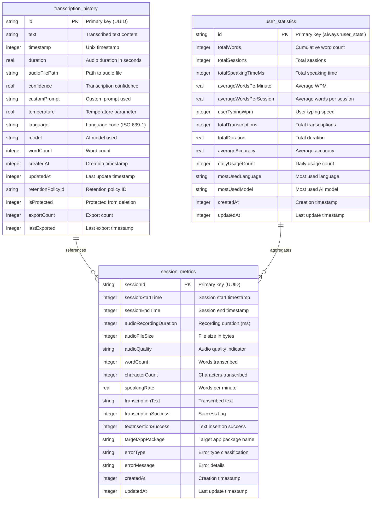

# Database Schema Documentation

## Overview

WhisperTop uses a **Room database** with **SQLCipher encryption** for local data persistence. The database stores transcription history, session metrics, and user statistics to provide analytics and improve the user experience while maintaining data privacy.

**Database Details:**
- **Database Name**: `whispertop_database.db`
- **Current Version**: 4
- **Encryption**: SQLCipher with Android Keystore integration
- **Architecture**: Room ORM with Android-specific implementation

## Database Schema

### Entity Relationship Diagram



---

## Table Definitions

### 1. `transcription_history`

**Purpose**: Stores individual transcription records with full context and metadata.

```sql
CREATE TABLE transcription_history (
    id TEXT PRIMARY KEY NOT NULL,
    text TEXT NOT NULL,
    timestamp INTEGER NOT NULL,
    duration REAL,
    audioFilePath TEXT,
    confidence REAL,
    customPrompt TEXT,
    temperature REAL,
    language TEXT,
    model TEXT,
    wordCount INTEGER NOT NULL DEFAULT 0,
    createdAt INTEGER NOT NULL,
    updatedAt INTEGER NOT NULL,
    -- Retention and export tracking (v4)
    retentionPolicyId TEXT,
    isProtected INTEGER NOT NULL DEFAULT 0,
    exportCount INTEGER NOT NULL DEFAULT 0,
    lastExported INTEGER
);
```

**Key Fields:**
- **`id`**: UUID primary key
- **`text`**: The transcribed text content (encrypted at rest)
- **`timestamp`**: When transcription occurred
- **`confidence`**: AI model confidence score (0.0-1.0)
- **`retentionPolicyId`**: Links to retention policy for automatic cleanup
- **`isProtected`**: Boolean flag to prevent automatic deletion

**Indexes:**
```sql
CREATE INDEX idx_timestamp ON transcription_history(timestamp);
CREATE INDEX idx_text_search ON transcription_history(text);
CREATE INDEX idx_retention_policy ON transcription_history(retentionPolicyId);
CREATE INDEX idx_protected ON transcription_history(isProtected);
CREATE INDEX idx_last_exported ON transcription_history(lastExported);
CREATE INDEX idx_retention_cleanup ON transcription_history(retentionPolicyId, timestamp, isProtected);
```

---

### 2. `session_metrics`

**Purpose**: Captures detailed analytics for each transcription session, including performance metrics and error tracking.

```sql
CREATE TABLE session_metrics (
    sessionId TEXT PRIMARY KEY NOT NULL,
    sessionStartTime INTEGER NOT NULL,
    sessionEndTime INTEGER,
    audioRecordingDuration INTEGER NOT NULL DEFAULT 0,
    audioFileSize INTEGER NOT NULL DEFAULT 0,
    audioQuality TEXT,
    wordCount INTEGER NOT NULL DEFAULT 0,
    characterCount INTEGER NOT NULL DEFAULT 0,
    speakingRate REAL NOT NULL DEFAULT 0.0,
    transcriptionText TEXT,
    transcriptionSuccess INTEGER NOT NULL DEFAULT 0,
    textInsertionSuccess INTEGER NOT NULL DEFAULT 0,
    targetAppPackage TEXT,
    errorType TEXT,
    errorMessage TEXT,
    createdAt INTEGER NOT NULL,
    updatedAt INTEGER NOT NULL
);
```

**Key Fields:**
- **`sessionId`**: UUID for session tracking
- **`speakingRate`**: Words per minute calculation
- **`transcriptionSuccess`**: Boolean success indicator
- **`targetAppPackage`**: Android package name where text was inserted
- **`errorType`**: Categorized error type for analytics

**Performance Indexes:**
```sql
-- Basic indexes
CREATE INDEX idx_session_start_time ON session_metrics(sessionStartTime);
CREATE INDEX idx_target_app ON session_metrics(targetAppPackage);
CREATE INDEX idx_transcription_success ON session_metrics(transcriptionSuccess);

-- Composite indexes for analytics queries
CREATE INDEX idx_session_metrics_daily_stats ON session_metrics(
    sessionStartTime, transcriptionSuccess, wordCount, characterCount, audioRecordingDuration
);

CREATE INDEX idx_session_metrics_errors ON session_metrics(errorType, sessionStartTime) 
WHERE errorType IS NOT NULL;

CREATE INDEX idx_session_metrics_app_usage ON session_metrics(
    targetAppPackage, sessionStartTime, transcriptionSuccess
) WHERE targetAppPackage IS NOT NULL;
```

---

### 3. `user_statistics`

**Purpose**: Maintains aggregated user statistics and preferences. Uses singleton pattern with single record.

```sql
CREATE TABLE user_statistics (
    id TEXT PRIMARY KEY NOT NULL DEFAULT 'user_stats',
    totalWords INTEGER NOT NULL DEFAULT 0,
    totalSessions INTEGER NOT NULL DEFAULT 0,
    totalSpeakingTimeMs INTEGER NOT NULL DEFAULT 0,
    averageWordsPerMinute REAL NOT NULL DEFAULT 0.0,
    averageWordsPerSession REAL NOT NULL DEFAULT 0.0,
    userTypingWpm INTEGER NOT NULL DEFAULT 0,
    totalTranscriptions INTEGER NOT NULL DEFAULT 0,
    totalDuration REAL NOT NULL DEFAULT 0.0,
    averageAccuracy REAL,
    dailyUsageCount INTEGER NOT NULL DEFAULT 0,
    mostUsedLanguage TEXT,
    mostUsedModel TEXT,
    createdAt INTEGER NOT NULL,
    updatedAt INTEGER NOT NULL
);
```

**Key Fields:**
- **`id`**: Always `"user_stats"` (singleton pattern)
- **`totalWords`**: Cumulative word count across all transcriptions
- **`userTypingWpm`**: User's typing speed for productivity calculations
- **`averageAccuracy`**: Calculated transcription accuracy

---

## Database Migration History

### Version 1 → 2 (MIGRATION_1_2)

**Changes:**
- Added `session_metrics` table
- Created performance indexes for session analytics

**Migration SQL:**
```sql
-- Create session_metrics table
CREATE TABLE session_metrics (
    sessionId TEXT PRIMARY KEY NOT NULL,
    sessionStartTime INTEGER NOT NULL,
    sessionEndTime INTEGER,
    -- ... (full table definition)
);

-- Create initial indexes
CREATE INDEX idx_session_start_time ON session_metrics(sessionStartTime);
CREATE INDEX idx_target_app ON session_metrics(targetAppPackage);
CREATE INDEX idx_transcription_success ON session_metrics(transcriptionSuccess);
```

### Version 2 → 3 (MIGRATION_2_3)

**Changes:**
- Added performance-optimized composite indexes
- Enhanced analytics capabilities
- Added text search support

**Key Indexes Added:**
```sql
-- Composite index for daily aggregation queries
CREATE INDEX idx_session_metrics_daily_stats ON session_metrics(
    sessionStartTime, transcriptionSuccess, wordCount, characterCount, audioRecordingDuration
);

-- Error analysis index
CREATE INDEX idx_session_metrics_errors ON session_metrics(errorType, sessionStartTime) 
WHERE errorType IS NOT NULL;

-- App usage analytics
CREATE INDEX idx_session_metrics_app_usage ON session_metrics(
    targetAppPackage, sessionStartTime, transcriptionSuccess
) WHERE targetAppPackage IS NOT NULL;
```

### Version 3 → 4 (MIGRATION_3_4)

**Changes:**
- Added retention policy support to `transcription_history`
- Added export tracking capabilities
- Enhanced data lifecycle management

**Schema Changes:**
```sql
-- Add retention fields
ALTER TABLE transcription_history ADD COLUMN retentionPolicyId TEXT DEFAULT NULL;
ALTER TABLE transcription_history ADD COLUMN isProtected INTEGER NOT NULL DEFAULT 0;
ALTER TABLE transcription_history ADD COLUMN exportCount INTEGER NOT NULL DEFAULT 0;
ALTER TABLE transcription_history ADD COLUMN lastExported INTEGER DEFAULT NULL;

-- Create retention indexes
CREATE INDEX idx_retention_cleanup ON transcription_history(
    retentionPolicyId, timestamp, isProtected
);
```

---

## Database Configuration

### Encryption and Security

**SQLCipher Configuration:**
```kotlin
// Key management via Android Keystore
val databaseKey = DatabaseKeyManager.getDatabaseKey()

// Room database with encryption
Room.databaseBuilder(context, AppDatabase::class.java, DATABASE_NAME)
    .openHelperFactory(SupportFactory(databaseKey))
    .addMigrations(MIGRATION_1_2, MIGRATION_2_3, MIGRATION_3_4)
    .build()
```

**Security Features:**
- **Encryption**: 256-bit AES encryption via SQLCipher
- **Key Storage**: Android Keystore for key management
- **Key Backup**: Secure key backup and recovery
- **Memory Protection**: Key zeroization after use

### Performance Optimization

**PRAGMA Settings:**
```sql
-- WAL mode for better concurrency
PRAGMA journal_mode = WAL;

-- Optimize cache size (default: -2000 = 2MB)
PRAGMA cache_size = -8192;  -- 8MB cache

-- Enable foreign key constraints
PRAGMA foreign_keys = ON;

-- Set busy timeout for concurrent access
PRAGMA busy_timeout = 30000;  -- 30 seconds
```

**Index Strategy:**
- **Composite Indexes**: Optimized for common query patterns
- **Covering Indexes**: Include frequently accessed columns
- **Partial Indexes**: Use WHERE clauses to reduce index size
- **Query-Specific**: Designed for analytics and search operations

---

## Data Access Patterns

### Common Query Patterns

**Daily Statistics:**
```sql
SELECT 
    DATE(sessionStartTime/1000, 'unixepoch') as date,
    COUNT(*) as sessions,
    SUM(wordCount) as totalWords,
    AVG(speakingRate) as avgWpm,
    SUM(audioRecordingDuration) as totalDuration
FROM session_metrics 
WHERE sessionStartTime >= ? AND transcriptionSuccess = 1
GROUP BY DATE(sessionStartTime/1000, 'unixepoch')
ORDER BY date DESC;
```

**Error Analysis:**
```sql
SELECT 
    errorType,
    COUNT(*) as errorCount,
    COUNT(*) * 100.0 / (SELECT COUNT(*) FROM session_metrics WHERE sessionStartTime >= ?) as percentage
FROM session_metrics 
WHERE sessionStartTime >= ? AND errorType IS NOT NULL
GROUP BY errorType
ORDER BY errorCount DESC;
```

**App Usage Analytics:**
```sql
SELECT 
    targetAppPackage,
    COUNT(*) as usageCount,
    AVG(wordCount) as avgWords,
    SUM(CASE WHEN transcriptionSuccess THEN 1 ELSE 0 END) * 100.0 / COUNT(*) as successRate
FROM session_metrics 
WHERE targetAppPackage IS NOT NULL AND sessionStartTime >= ?
GROUP BY targetAppPackage
ORDER BY usageCount DESC
LIMIT 10;
```

### Repository Pattern

**Data Access Objects (DAOs):**
- **`TranscriptionHistoryDao`**: CRUD operations, search, pagination
- **`SessionMetricsDao`**: Analytics queries, aggregations, error reporting  
- **`UserStatisticsDao`**: Statistics updates, preference management

**Repository Implementations:**
- **Caching**: In-memory caching for frequently accessed data
- **Pagination**: Room's PagingSource integration
- **Background Operations**: Coroutines for non-blocking database access

---

## Data Retention and Cleanup

### Retention Policies

**Policy Types:**
1. **Time-based**: Delete records older than X days
2. **Count-based**: Keep only last N records
3. **Size-based**: Cleanup when database exceeds size limit
4. **Protected**: Never delete records marked as protected

**Implementation:**
```kotlin
// Automatic cleanup based on retention policy
suspend fun cleanupOldRecords() {
    val retentionDays = appSettings.historyRetentionDays
    val cutoffTime = System.currentTimeMillis() - (retentionDays * 24 * 60 * 60 * 1000)
    
    dao.deleteOldRecords(
        cutoffTime = cutoffTime,
        excludeProtected = true
    )
}
```

### Data Export

**Export Capabilities:**
- **JSON Format**: Full data export with metadata
- **CSV Format**: Tabular data for analysis
- **Filtered Export**: Export by date range, app, or criteria
- **Privacy-Safe**: Exclude sensitive data based on privacy settings

**Export Tracking:**
- Track export count per record
- Record last export timestamp
- Support incremental exports

---

## Database Maintenance

### Performance Monitoring

**Key Metrics:**
- Query execution time
- Database size growth
- Index usage statistics
- Cache hit rates
- Connection pool utilization

**Monitoring Implementation:**
```kotlin
// Database performance monitoring
class DatabasePerformanceMonitor {
    fun logSlowQuery(query: String, executionTime: Long) {
        if (executionTime > SLOW_QUERY_THRESHOLD) {
            logger.warn("Slow query detected: $query ($executionTime ms)")
        }
    }
    
    fun trackDatabaseSize() {
        val size = databaseFile.length()
        metricsCollector.recordDatabaseSize(size)
    }
}
```

### Backup and Recovery

**Backup Strategy:**
1. **Encrypted Key Backup**: Store database key securely
2. **Schema Backup**: Export schema definitions
3. **Data Export**: Regular data exports for recovery
4. **Version Tracking**: Maintain version compatibility

**Recovery Process:**
1. Restore database key from secure storage
2. Create database with correct schema version
3. Import data with appropriate migrations
4. Validate data integrity

### Health Checks

**Validation Checks:**
```sql
-- Check for orphaned records
SELECT COUNT(*) FROM session_metrics sm 
LEFT JOIN transcription_history th ON sm.sessionId = th.id 
WHERE th.id IS NULL;

-- Validate index integrity
PRAGMA integrity_check;

-- Check database statistics
PRAGMA table_info(transcription_history);
PRAGMA index_info(idx_retention_cleanup);
```

---

## Future Migration Considerations

### Planned Enhancements

**Version 5 Considerations:**
- **Full-Text Search**: SQLite FTS5 integration
- **Compression**: Implement text compression for large transcriptions
- **Partitioning**: Time-based table partitioning for scalability
- **iOS Support**: Cross-platform database synchronization

**Migration Planning:**
- **Backward Compatibility**: Ensure older app versions can read new schema
- **Data Validation**: Validate data integrity during migrations
- **Rollback Support**: Implement migration rollback capability
- **Performance Testing**: Benchmark migration performance on large datasets

### Cross-Platform Considerations

**Multiplatform Database:**
- **SQLDelight**: Consider migration to SQLDelight for shared database code
- **Synchronization**: Design for eventual iOS/web synchronization
- **Schema Sharing**: Share schema definitions across platforms
- **Testing**: Comprehensive testing across all target platforms

---

## Conclusion

The WhisperTop database schema is designed for performance, privacy, and scalability. The current version (4) provides comprehensive analytics while maintaining data security through encryption and retention policies.

**Key Strengths:**
- ✅ Comprehensive analytics and performance tracking
- ✅ Strong encryption and security model
- ✅ Optimized indexes for common query patterns
- ✅ Flexible retention and export capabilities
- ✅ Well-documented migration history

**Future Improvements:**
- 🔄 Full-text search integration
- 🔄 Cross-platform synchronization
- 🔄 Advanced analytics with ML integration
- 🔄 Enhanced compression and optimization

For implementation details, see the related documentation:
- [API Documentation](./api/README.md) for DAO interfaces
- [Performance Documentation](./performance/README.md) for optimization guidelines
- [Migration Guide](./migration/README.md) for upgrade procedures