# Architecture Overview

## Introduction

WhisperTop follows a **Clean Architecture** pattern with **Kotlin Multiplatform** support, implementing **MVVM** for the presentation layer. The architecture is designed for scalability, testability, and cross-platform compatibility while maintaining strict separation of concerns.

## High-Level Architecture

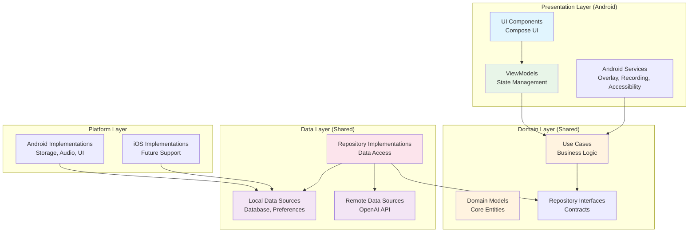

## Architecture Layers

### 1. **Presentation Layer** (Android-specific)

**Location**: `composeApp/src/androidMain/kotlin/`

**Responsibilities:**
- User interface components using Jetpack Compose
- ViewModels for state management and business logic coordination
- Android-specific services (overlay, recording, accessibility)
- Navigation and user interaction handling

**Key Components:**
- **UI Components**: Compose screens and reusable components
- **ViewModels**: `AudioRecordingViewModel`, `SettingsViewModel`
- **Services**: `AudioRecordingService`, `OverlayService`, `WhisperTopAccessibilityService`
- **Managers**: Permission handling, service coordination

**Dependencies**: Domain layer (Use Cases, Models)

### 2. **Domain Layer** (Shared)

**Location**: `shared/src/commonMain/kotlin/.../domain/`

**Responsibilities:**
- Core business logic and rules
- Use case implementations
- Domain models and entities
- Repository interfaces (contracts)

**Key Components:**
- **Use Cases**: `StartRecordingUseCase`, `StopRecordingUseCase`, `ApiKeyUseCase`
- **Models**: `AppSettings`, `AudioFile`, `TranscriptionRequest/Response`, `RecordingState`
- **Repository Interfaces**: `AudioRepository`, `SettingsRepository`, `TranscriptionRepository`
- **Services**: Abstract service interfaces for platform-specific implementations

**Dependencies**: None (pure business logic)

### 3. **Data Layer** (Shared)

**Location**: `shared/src/commonMain/kotlin/.../data/`

**Responsibilities:**
- Repository implementations
- Data source abstractions
- API communication
- Local data persistence
- Data transformation between layers

**Key Components:**
- **Repositories**: Concrete implementations of domain interfaces
- **Remote Data Sources**: OpenAI API client, HTTP communication
- **Local Data Sources**: Database DAOs, SharedPreferences/DataStore
- **Models**: DTOs for API communication, Entity models for database

**Dependencies**: Platform layer for concrete implementations

### 4. **Platform Layer** (Platform-specific)

**Locations**: 
- `shared/src/androidMain/kotlin/`
- `shared/src/iosMain/kotlin/` (future)

**Responsibilities:**
- Platform-specific implementations using expect/actual pattern
- Hardware access (microphone, storage)
- Platform APIs integration
- Security and encryption

**Key Components:**
- **Audio Recording**: MediaRecorder (Android), AVAudioRecorder (iOS)
- **File System**: Platform-specific file operations
- **Encryption**: Android Keystore, iOS Keychain
- **Database**: Room (Android), Core Data consideration (iOS)

## Data Flow Architecture

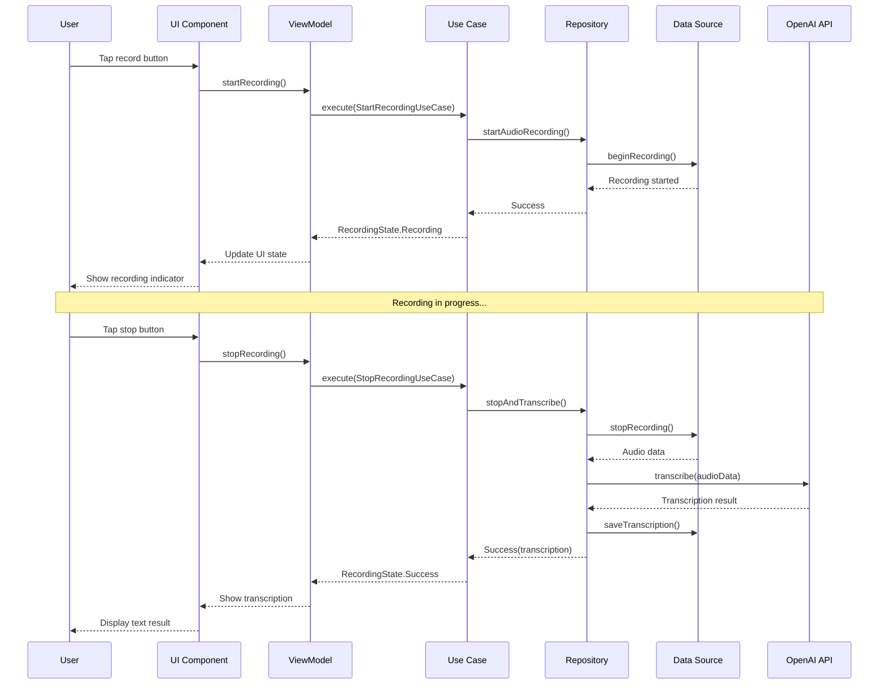

## Dependency Injection Architecture

**Framework**: Koin

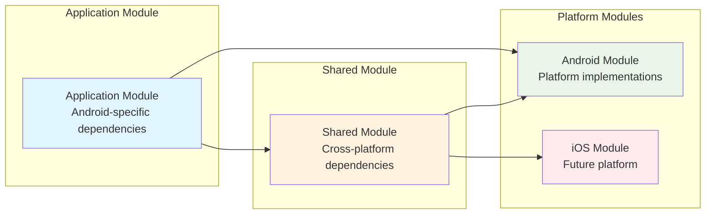

**Koin Module Structure:**

```kotlin
// Shared module (commonMain)
val sharedModule = module {
    // Use Cases
    single<StartRecordingUseCase> { StartRecordingUseCase(get(), get()) }
    single<StopRecordingUseCase> { StopRecordingUseCase(get(), get()) }
    
    // Repository Interfaces -> Implementations
    single<AudioRepository> { AudioRepositoryImpl(get(), get()) }
    single<SettingsRepository> { SettingsRepositoryImpl(get()) }
    single<TranscriptionRepository> { TranscriptionRepositoryImpl(get(), get()) }
}

// Android module (androidMain)
val androidModule = module {
    // Platform-specific implementations
    single<AudioRecorderService> { AndroidAudioRecorderService(androidContext()) }
    single<FileReaderService> { AndroidFileReaderService(androidContext()) }
    single<PreferencesDataSource> { createPreferencesDataSource(androidContext()) }
}

// Application module (Android app)
val applicationModule = module {
    // ViewModels
    viewModel { AudioRecordingViewModel(get(), get(), get()) }
    viewModel { SettingsViewModel(get(), get()) }
    
    // Android Services
    single<OverlayService> { OverlayService() }
    single<AudioRecordingService> { AudioRecordingService() }
}
```

## State Management

### Recording State Machine

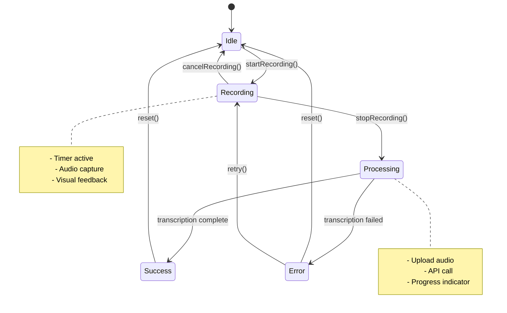

**State Implementation:**

```kotlin
sealed class RecordingState {
    object Idle : RecordingState()
    data class Recording(
        val startTime: Long,
        val duration: Long = 0L
    ) : RecordingState()
    
    data class Processing(
        val progress: Float = 0f
    ) : RecordingState()
    
    data class Success(
        val audioFile: AudioFile,
        val transcription: String
    ) : RecordingState()
    
    data class Error(
        val throwable: Throwable,
        val retryable: Boolean = true
    ) : RecordingState()
}
```

## Component Architecture

### Audio Recording Component

```mermaid
graph TD
    subgraph "Audio Recording System"
        ARS[AudioRecordingService<br/>Foreground Service]
        ARM[AudioRecordingManager<br/>Coordination]
        AR[AudioRecorder<br/>Platform Implementation]
        WAV[WAV File Generator<br/>Audio Processing]
    end
    
    subgraph "Overlay System"
        OS[OverlayService<br/>System Overlay]
        MBO[MicButtonOverlay<br/>Floating UI]
        DM[DragManager<br/>Touch Handling]
    end
    
    subgraph "Accessibility System"
        WAS[WhisperTopAccessibilityService<br/>Text Insertion]
        TIU[TextInsertionUtils<br/>Accessibility API]
        PERM[PermissionManager<br/>Permission Handling]
    end
    
    ARS --> ARM
    ARM --> AR
    ARM --> WAV
    OS --> MBO
    MBO --> DM
    WAS --> TIU
    WAS --> PERM
    
    ARM -.-> OS : Start/Stop Overlay
    TIU -.-> ARM : Text Insertion Events
```

### Settings and Configuration

```mermaid
graph TD
    subgraph "Settings Management"
        SM[SettingsManager<br/>Configuration Hub]
        AS[AppSettings<br/>Domain Model]
        PDS[PreferencesDataSource<br/>Encrypted Storage]
        MH[MigrationHelper<br/>Version Management]
    end
    
    subgraph "API Configuration"
        AC[ApiConfiguration<br/>OpenAI Settings]
        KC[KeyManager<br/>API Key Security]
        EP[EndpointValidator<br/>Custom Endpoint Support]
    end
    
    subgraph "Theme and UI"
        TM[ThemeManager<br/>Material 3 Theming]
        TC[ThemeConfiguration<br/>User Preferences]
        DC[DynamicColor<br/>Material You]
    end
    
    SM --> AS
    AS --> PDS
    SM --> MH
    AC --> KC
    AC --> EP
    TM --> TC
    TC --> DC
    
    SM -.-> AC : API Settings
    SM -.-> TM : Theme Settings
```

## Performance Architecture

### Memory Management

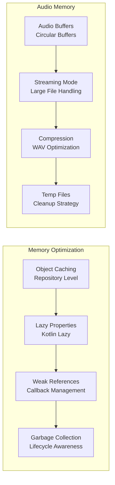

### Database Performance

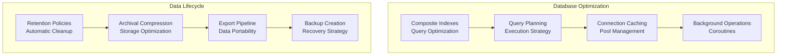

## Security Architecture

```mermaid
graph TB
    subgraph "Encryption Layer"
        AK[Android Keystore<br/>Hardware Security]
        SC[SQLCipher<br/>Database Encryption]
        EP[Encrypted Preferences<br/>Settings Security]
        KM[Key Management<br/>Rotation & Backup]
    end
    
    subgraph "API Security"
        AS[API Key Security<br/>Secure Storage]
        TLS[TLS Communication<br/>Certificate Pinning]
        RV[Request Validation<br/>Input Sanitization]
        RT[Rate Limiting<br/>Abuse Prevention]
    end
    
    subgraph "Privacy Protection"
        DL[Data Lifecycle<br/>Retention Management]
        AL[Audit Logging<br/>Access Tracking]
        UP[User Permissions<br/>Privacy Controls]
        DE[Data Encryption<br/>At-Rest & In-Transit]
    end
    
    AK --> SC
    SC --> EP
    EP --> KM
    AS --> TLS
    TLS --> RV
    RV --> RT
    DL --> AL
    AL --> UP
    UP --> DE
```

## Testing Architecture

### Test Layer Structure

```mermaid
graph TD
    subgraph "Unit Tests"
        DT[Domain Tests<br/>Business Logic]
        RT[Repository Tests<br/>Data Layer]
        VT[ViewModel Tests<br/>Presentation Logic]
        UT[Utility Tests<br/>Helper Functions]
    end
    
    subgraph "Integration Tests"
        AT[API Tests<br/>Network Layer]
        DB[Database Tests<br/>Room Integration]
        ST[Service Tests<br/>Android Services]
        CT[Component Tests<br/>UI Components]
    end
    
    subgraph "UI Tests"
        ET[End-to-End Tests<br/>User Workflows]
        IT[Instrumented Tests<br/>Device Testing]
        PT[Performance Tests<br/>Benchmarking]
        AT_UI[Accessibility Tests<br/>A11y Compliance]
    end
    
    DT --> RT
    RT --> VT
    VT --> UT
    AT --> DB
    DB --> ST
    ST --> CT
    ET --> IT
    IT --> PT
    PT --> AT_UI
```

## Platform-Specific Implementations

### Android Architecture

```mermaid
graph TB
    subgraph "Android Components"
        MA[MainActivity<br/>Entry Point]
        FS[Foreground Services<br/>Background Processing]
        BR[Broadcast Receivers<br/>System Events]
        CP[Content Providers<br/>Data Sharing]
    end
    
    subgraph "Android Services"
        ARS[AudioRecordingService<br/>Recording Management]
        OS[OverlayService<br/>System Overlay]
        AS[AccessibilityService<br/>Text Insertion]
        TS[TileService<br/>Quick Settings]
    end
    
    subgraph "Android Storage"
        R[Room Database<br/>Local Storage]
        DS[DataStore<br/>Preferences]
        IF[Internal Files<br/>Audio Storage]
        AK[Android Keystore<br/>Security]
    end
    
    MA --> FS
    FS --> BR
    BR --> CP
    ARS --> OS
    OS --> AS
    AS --> TS
    R --> DS
    DS --> IF
    IF --> AK
```

### Future iOS Architecture

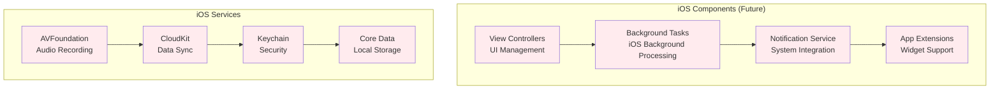

## Error Handling Architecture

### Error Classification

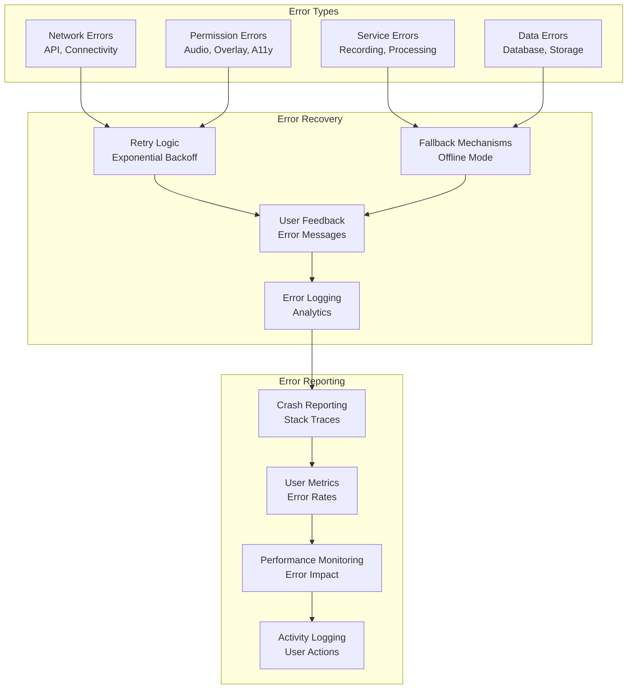

## Build and Deployment Architecture

### Build Configuration

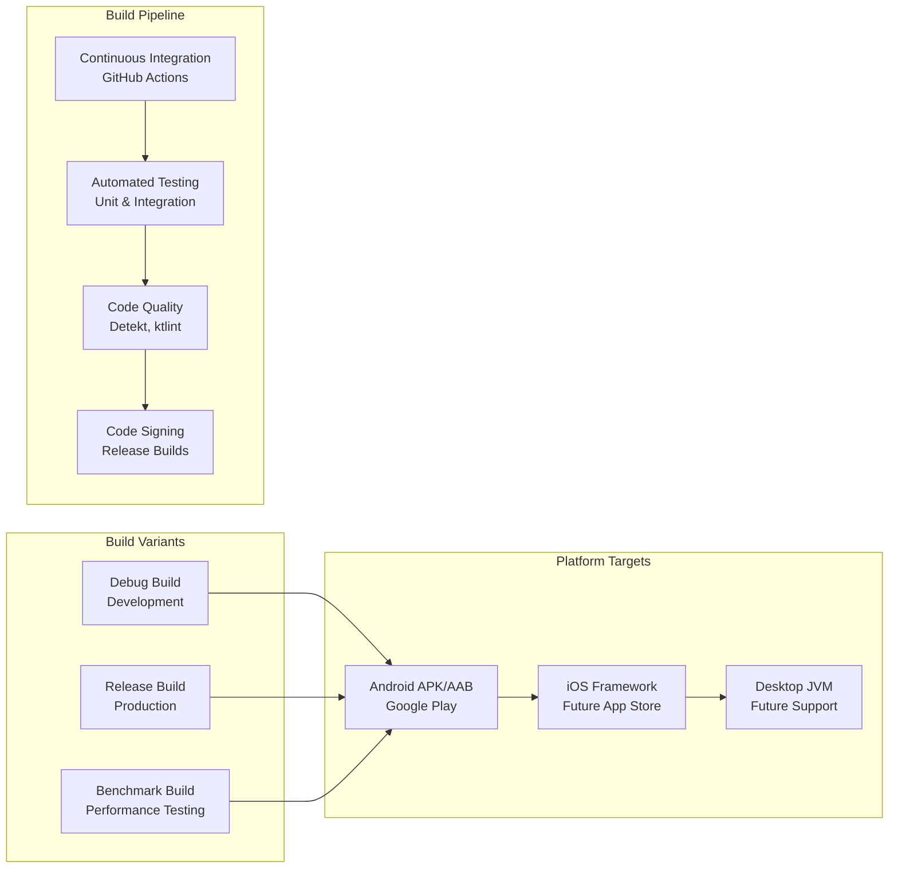

## Conclusion

WhisperTop's architecture is designed for:

- **Scalability**: Clean separation of concerns and modular design
- **Testability**: Dependency injection and interface-based design
- **Cross-platform**: Kotlin Multiplatform with shared business logic
- **Performance**: Optimized data access and memory management
- **Security**: Comprehensive encryption and privacy protection
- **Maintainability**: Clear architectural boundaries and documentation

The architecture supports current Android development while providing a foundation for future iOS expansion and additional platform support.

For detailed implementation examples, see:
- [API Documentation](../api/README.md)
- [Database Schema](../DATABASE_SCHEMA.md)
- [Performance Guidelines](../performance/README.md)
- [Testing Strategy](../TESTING.md)