# Component Interaction Diagrams

## Overview

This document provides detailed component interaction diagrams showing how different parts of WhisperTop work together to deliver core functionality.

## Core Recording Workflow

### Complete Transcription Flow

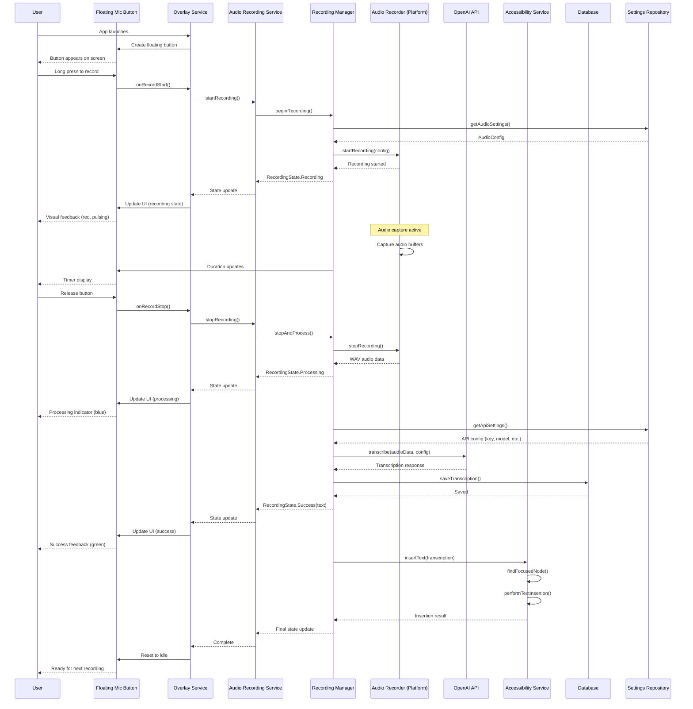

## Settings and Configuration Flow

### Settings Management Interaction

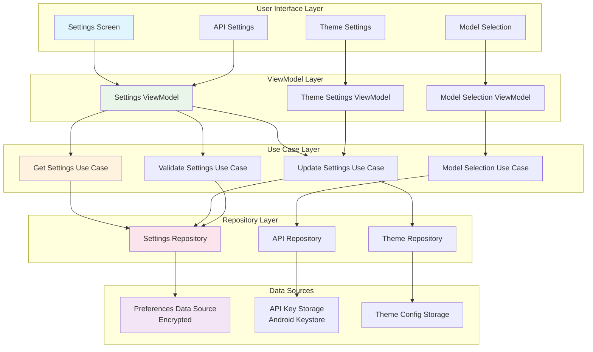

### Settings Persistence Flow

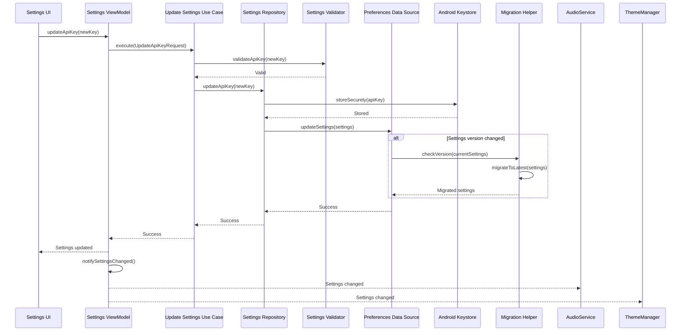

## Audio Processing Pipeline

### Audio Recording and Processing

```mermaid
graph LR
    subgraph "Audio Capture"
        MIC[Microphone<br/>Hardware]
        AR[AudioRecorder<br/>MediaRecorder/AVAudio]
        AB[Audio Buffers<br/>Circular Buffer]
        AC[Audio Converter<br/>Format Processing]
    end
    
    subgraph "Audio Processing"
        WAV[WAV Generator<br/>Header + PCM Data]
        QA[Quality Analyzer<br/>Audio Validation]
        COMP[Compressor<br/>Size Optimization]
        TF[Temp File<br/>Storage Manager]
    end
    
    subgraph "Upload Pipeline"
        UP[Upload Preparer<br/>Multipart Form]
        HC[HTTP Client<br/>Ktor Client]
        API[OpenAI API<br/>Transcription Service]
        RH[Response Handler<br/>Error Management]
    end
    
    subgraph "Post-Processing"
        TP[Text Processor<br/>Cleanup & Format]
        DB[Database Storage<br/>History & Metrics]
        TI[Text Insertion<br/>Accessibility API]
        NOTIF[Notification<br/>Status Updates]
    end
    
    MIC --> AR
    AR --> AB
    AB --> AC
    AC --> WAV
    WAV --> QA
    QA --> COMP
    COMP --> TF
    TF --> UP
    UP --> HC
    HC --> API
    API --> RH
    RH --> TP
    TP --> DB
    TP --> TI
    TI --> NOTIF
```

### Error Handling in Audio Pipeline

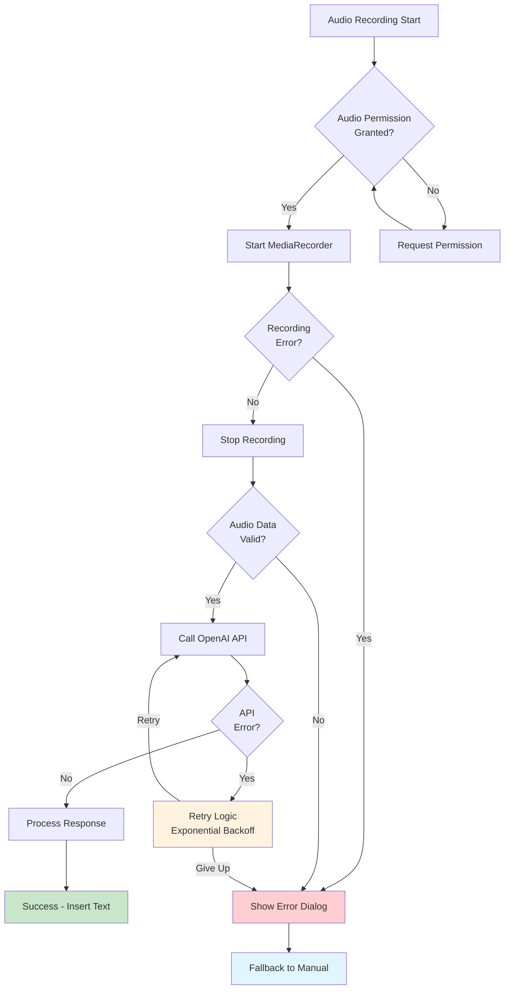

## Overlay System Architecture

### Overlay Service and Window Management

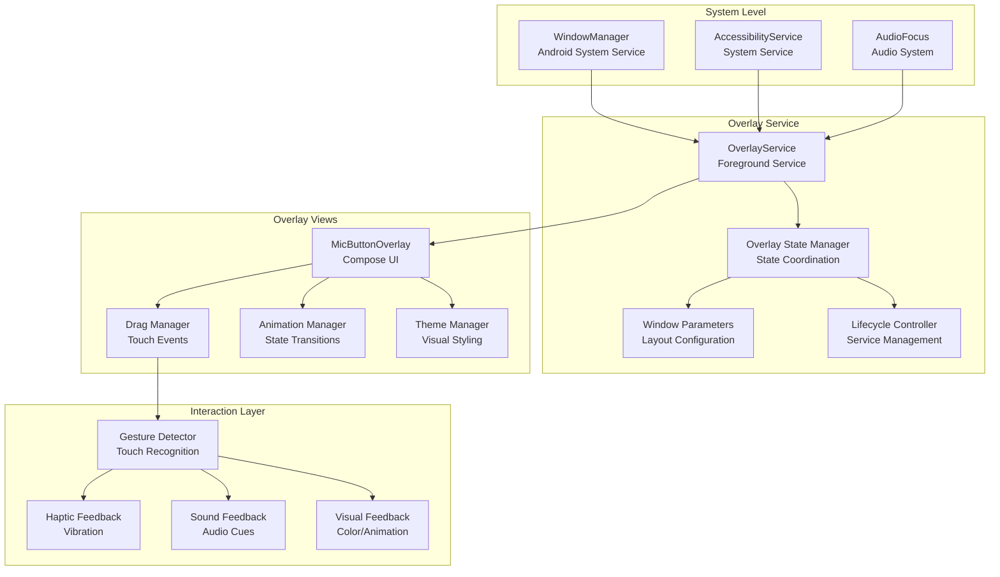

### Overlay Interaction States

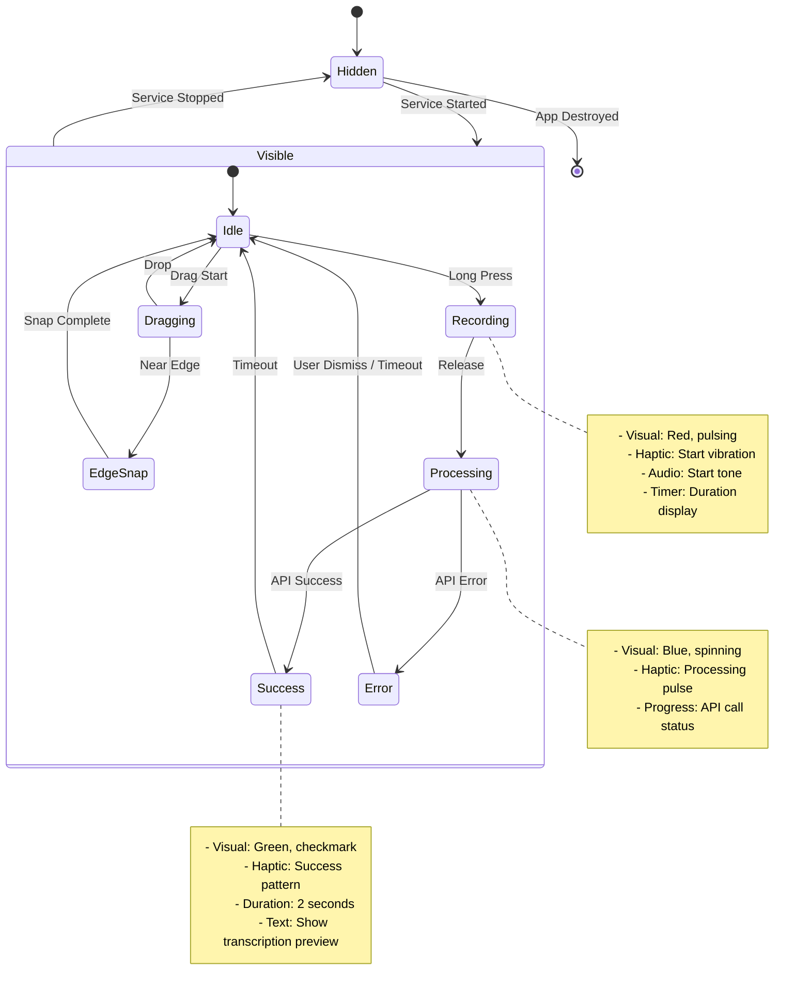

## Theme and Configuration System

### Theme Management Flow

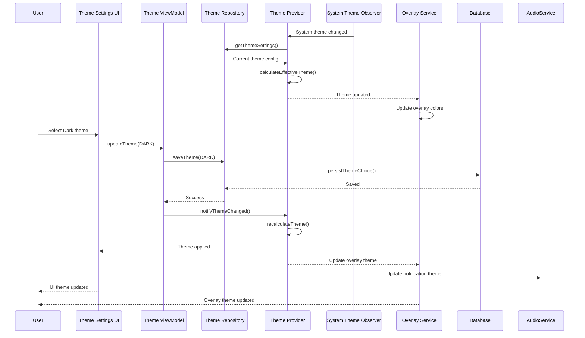

### Dynamic Color Integration

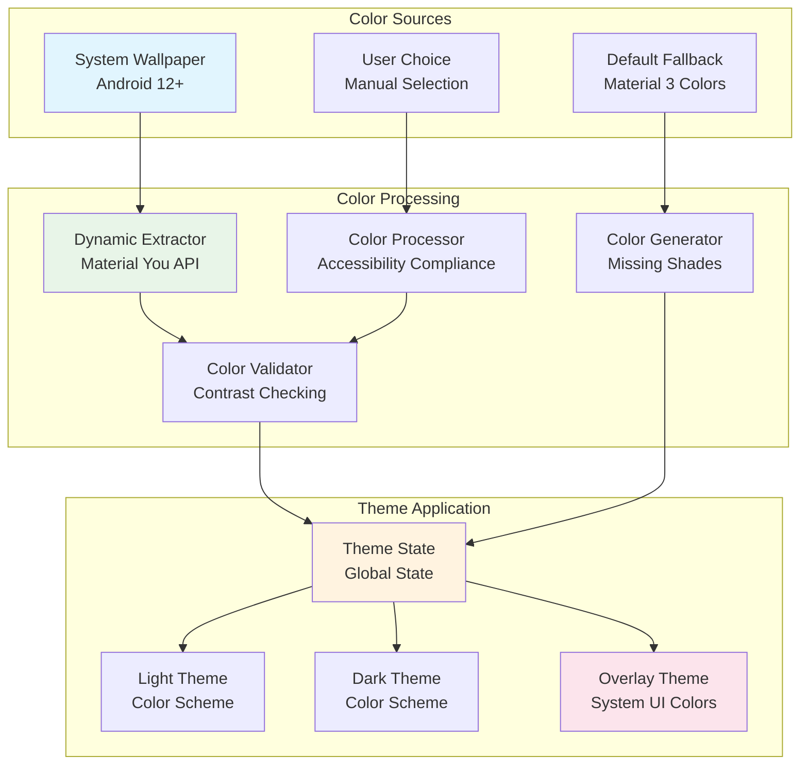

## Data Synchronization and Migration

### Data Migration Pipeline

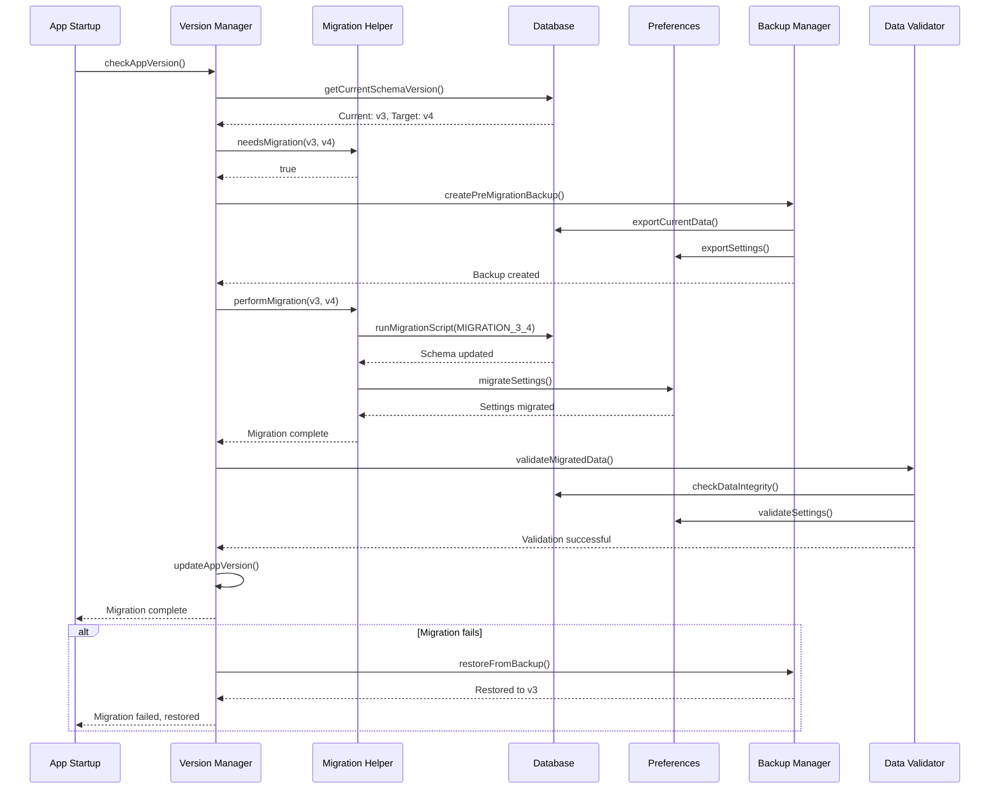

### Settings Migration Detail

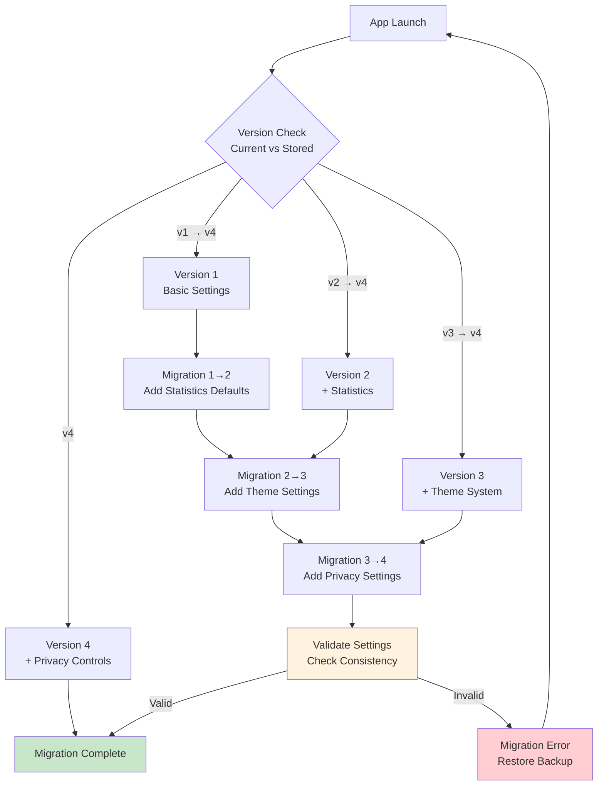

## Performance Monitoring Integration

### Performance Metrics Collection

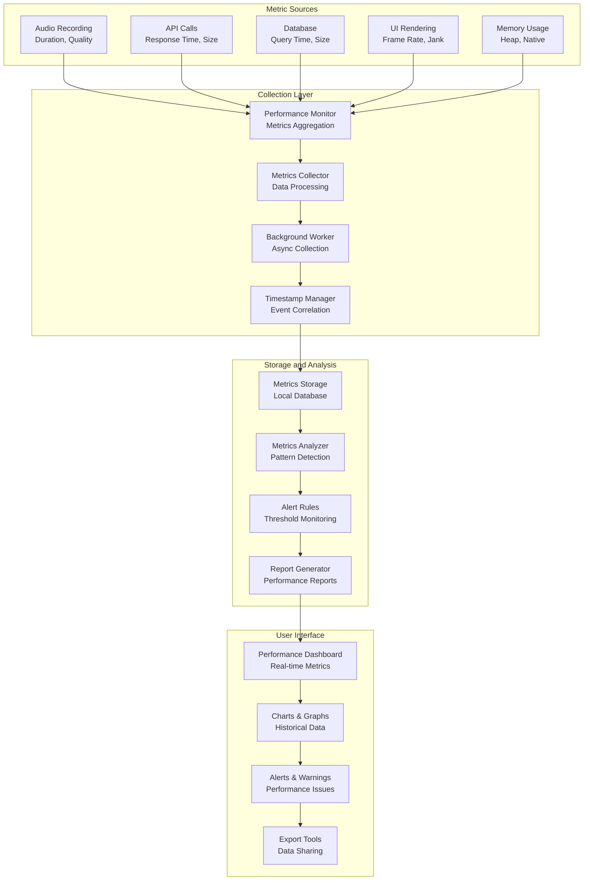

## Testing and Quality Assurance Flow

### Test Execution Pipeline

```mermaid
graph LR
    subgraph "Development"
        CODE[Code Changes<br/>Developer Commits]
        LINT[Static Analysis<br/>detekt, ktlint]
        UNIT[Unit Tests<br/>Business Logic]
        INT[Integration Tests<br/>Component Testing]
    end
    
    subgraph "CI Pipeline"
        BUILD[Build Validation<br/>Gradle Build]
        TEST_RUN[Test Execution<br/>All Test Suites]
        COVERAGE[Coverage Report<br/>Jacoco/Kover]
        QUALITY[Quality Gates<br/>SonarQube]
    end
    
    subgraph "Device Testing"
        EMU[Emulator Tests<br/>Multiple API Levels]
        DEVICE[Physical Device<br/>Real Hardware]
        E2E[End-to-End Tests<br/>User Workflows]
        PERF[Performance Tests<br/>Benchmarking]
    end
    
    subgraph "Release"
        SIGN[Code Signing<br/>Release Keys]
        DEPLOY[Deployment<br/>Play Store]
        MONITOR[Monitoring<br/>Crash Reports]
        FEEDBACK[User Feedback<br/>Analytics]
    end
    
    CODE --> LINT
    LINT --> UNIT
    UNIT --> INT
    INT --> BUILD
    BUILD --> TEST_RUN
    TEST_RUN --> COVERAGE
    COVERAGE --> QUALITY
    QUALITY --> EMU
    EMU --> DEVICE
    DEVICE --> E2E
    E2E --> PERF
    PERF --> SIGN
    SIGN --> DEPLOY
    DEPLOY --> MONITOR
    MONITOR --> FEEDBACK
```

## Conclusion

These component interaction diagrams illustrate how WhisperTop's architecture enables:

1. **Seamless User Experience**: Smooth flow from recording to text insertion
2. **Robust Error Handling**: Comprehensive error recovery at each layer
3. **Performance Optimization**: Efficient data processing and resource management
4. **Flexible Configuration**: Dynamic settings and theme management
5. **Quality Assurance**: Comprehensive testing and monitoring systems

The architecture ensures that each component has clear responsibilities while maintaining loose coupling through well-defined interfaces and dependency injection.